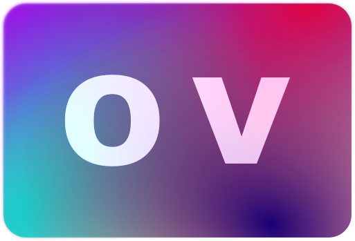

[](https://github.com/omniversion/omniversion-cli/releases/latest)
[](https://github.com/omniversion/omniversion-cli/actions?query=workflow%3A%22Upload%20code%20coverage%22)
[](https://codecov.io/gh/omniversion/omniversion)
[](/LICENSE)


> ### 🚧 **Status: proof of concept**
> [Feedback](https://github.com/omniversion/omniversion/discussions/1) much appreciated


<!--suppress HtmlDeprecatedAttribute -->
<div align="center">
    
    <h1 align="center">omniversion</h1>
    <br />
</div>

`omniversion` is a **dependency management toolbox** streamlining common maintenance tasks.

### Collection
[omniversion/ansible](ansible) collects versions and dependencies from servers orchestrated via Ansible.

### Aggregation
[omniversion/cli](cli) translates the output of many different version managers into a single, unified list.

### Analysis
[omniversion/python](python) adds convenience methods to create dashboards and reports in a few lines of code.

## Why use `omniversion`?

* Manage all dependencies in one place, across package managers and servers.
* Pull unmanaged versions (e.g. from config files and downloaded applications).
* View available updates, conflicts and security advisories in a single dashboard.
* Use only what you need and flexibly adapt it to your own use cases.

[More details on why omniversion was created](docs/WHY.md)

## Quick start

### Prerequisites

* `Ansible` >= 2.2
* `Python` >= 3.8
* `npm` or `homebrew`

### Steps

1. Install the Ansible collection, the CLI and the Python module:
    ```shell
    ansible-galaxy collection install layer9gmbh.omniversion
    npm install -g omniversion
    pip install omniversion
    ```


2. Run the `all` Ansible playbook
    ```shell
    ansible-playbook layer9gmbh.omniversion.fetch
    ```
    in a directory where Ansible can find your host definitions.


3. Run the Python sample dashboard:
    ```shell
    python3 -m omniversion.samples.dashboard
    ```

## Get in touch

- [ GitHub Discussions](https://github.com/omniversion/omniversion/discussions/1): provide feedback and participate in discussions
- [ GitHub Issues](https://github.com/omniversion/omniversion/issues): report a bug or request a feature

## Documentation

* [Ansible documentation](ansible/README.md)
* [CLI documentation](https://pkg.go.dev/github.com/omniversion/omniversion/cli)
* [Python documentation](https://omniversion.github.io/omniversion/python/omniversion/)

## Supported platforms

### Operating systems

`omniversion` has been built and tested on a macOS control node with linux hosts, but we do aim to support linux control nodes as well.

Like Ansible, we not support Windows control nodes, but this might change in the future, if there is demand.

### Package managers

| Name             | Supported  |
|------------------|------------|
| `ansible-galaxy` | ✅ yes      |
| `apt`            | ✅ yes      |
| `brew`           | ✅ yes      |
| `Composer`       | 🕙 planned |
| `go mod`         | ✅ yes      |
| `maven`          | 🕙 planned |
| `npm`            | ✅ yes      |
| `nvm`            | ✅ yes      |
| `pip`            | ✅ yes      |
| `rubygems`       | ✅ yes      |
| `rvm`            | ✅ yes      |
| `yarn`           | 🕙 planned |
